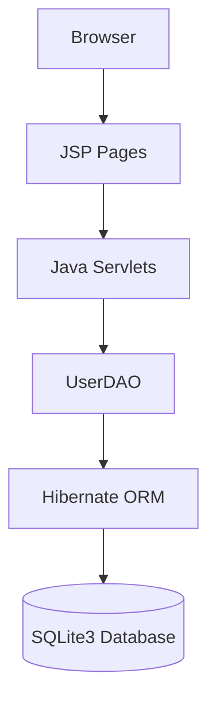
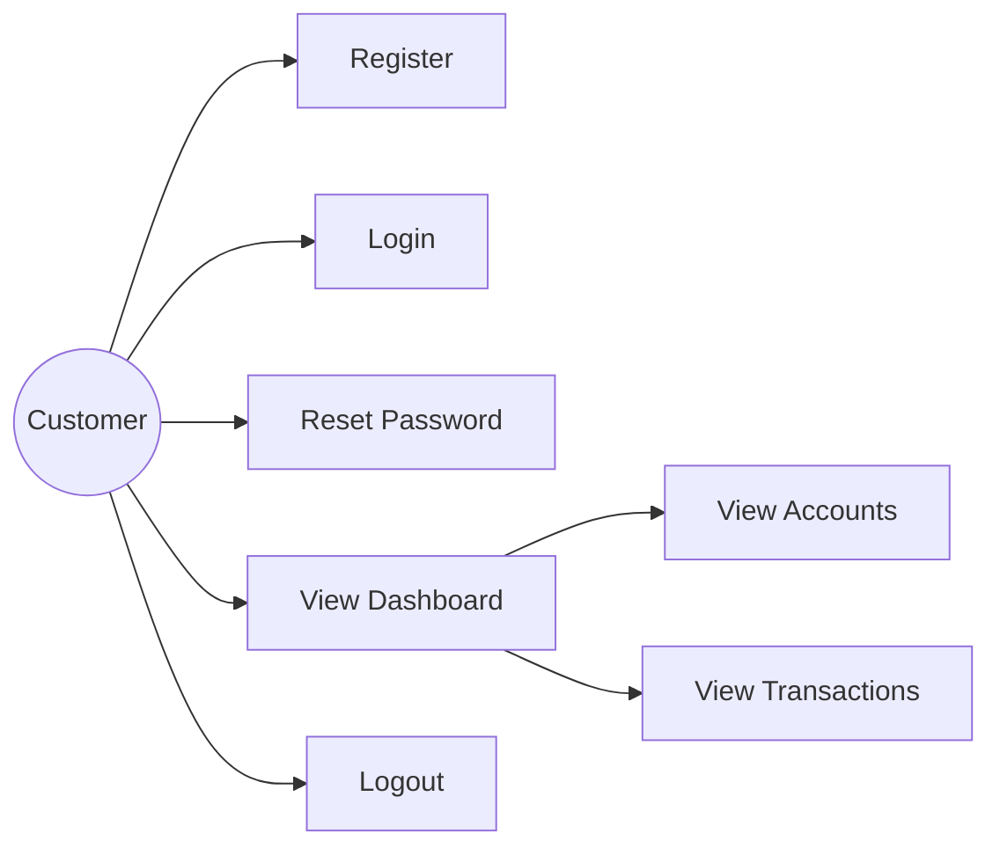
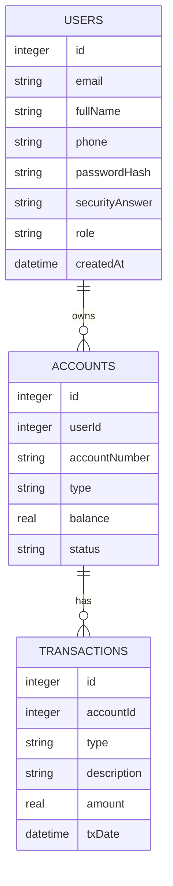
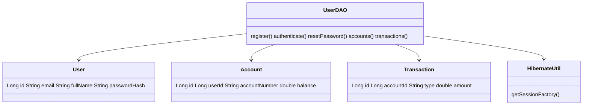

# Moushaifah Bank Web Application - Full Project Report

## 1. Project Overview
Moushaifah Bank is a Java Servlet based web application developed to simulate a real online banking login system. The application satisfies the homework requirement by implementing Login, Register and Forgot Password pages, while extending the scope into a modern banking dashboard with accounts and transaction history.

## 2. Functional Requirements
FR1: Users can register with full name, email, phone, password and security answer.  
FR2: Users can login using email and password.  
FR3: Users can reset their password through the Forgot Password page.  
FR4: Authenticated users can view a dashboard.  
FR5: The dashboard displays account balance, account number, status and transactions.  
FR6: The system seeds dummy users, accounts and transactions.  
FR7: Users can logout securely.

## 3. Non-Functional Requirements
NFR1: The user interface must be responsive on desktop and mobile devices.  
NFR2: The design must be consistent with the Moushaifah Bank theme.  
NFR3: Passwords must not be stored as plain text.  
NFR4: Database persistence must use SQLite3.  
NFR5: The code must use Java Servlet technology and Hibernate ORM.  
NFR6: The project must be easy to run using Maven commands.

## 4. Technology Stack
- Frontend: JSP, HTML5, CSS3, JavaScript
- Backend: Java Servlets
- ORM: Hibernate
- Database: SQLite3
- Security: BCrypt password hashing, HTTP sessions
- Build Tool: Maven
- Runtime: Jetty Maven Plugin

## 5. System Architecture

## 6. Use Case Diagram

## 7. Database Design

## 8. Class Overview

## 9. Testing
Manual tests included successful registration, duplicate email validation, successful login, failed login, password reset, dashboard access protection and logout.

## 10. Conclusion
The completed application goes beyond a basic login page by implementing database-backed authentication, dummy banking data, secure password handling, responsive design and complete documentation suitable for presentation and viva.
